# Humanoid ANN/SNN Comparison

This repository contains the code and experimental results for comparing artificial neural networks and spiking neural networks in the `Humanoid-v4` continuous control environment.

The project compares three approaches:

1. **ANN** — a standard fully connected artificial neural network trained with PPO.
2. **Converted SNN** — a spiking neural network obtained by converting a trained ANN actor.
3. **Hybrid SNN** — a model with an SNN actor and an ANN critic, trained directly with PPO.

The goal of the project is to compare these approaches in terms of control quality, stability, spike activity, and computational cost.

---

## Project structure

```text
humanoid_ann_snn_comparison/
├── scripts/
│   ├── train_ann.py
│   ├── convert_ann_to_snn.py
│   ├── train_hybrid_snn.py
│   ├── test_ann.py
│   ├── test_converted_snn.py
│   └── test_hybrid_snn.py
│
├── models/
│   ├── ann_128/
│   ├── ann_256/
│   ├── converted_snn/
│   └── hybrid_snn/
│
├── results/
│   ├── ann_128/
│   ├── ann_256/
│   ├── converted_snn/
│   └── hybrid_snn/
│
├── graphs/
│   ├── ann_128/
│   ├── ann_256/
│   ├── converted_snn/
│   └── hybrid_snn/
│
├── report/
│   └── LarinaEA_VKR_2026_v1.docx
│
├── environment.yml
├── README.md
└── .gitignore
```

---

## Models

### ANN

Two ANN configurations are used:

- **ANN-128**: two hidden layers with 128 neurons each;
- **ANN-256**: two hidden layers with 256 neurons each.

Both models are trained with PPO in the `Humanoid-v4` environment.

Each ANN model directory contains:

```text
models/ann_128/
├── best_model.zip
├── vec_normalize_best.pkl
├── final_model.zip
└── vec_normalize_final.pkl
```

```text
models/ann_256/
├── best_model.zip
├── vec_normalize_best.pkl
├── final_model.zip
└── vec_normalize_final.pkl
```

### Converted SNN

The converted SNN is obtained from the trained `ANN-256` actor.  
The ANN weights are copied into an SNN actor with LIF neurons.

The converted SNN uses:

- `num_steps = 8`;
- LIF neurons;
- `tanh` output activation;
- saved ANN normalization statistics.

The converted model is stored in:

```text
models/converted_snn/
├── snn_actor_state.pth
└── config.json
```

### Hybrid SNN

The hybrid SNN is trained directly with PPO.

Its architecture consists of:

- SNN actor based on LIF neurons;
- ANN critic;
- PPO training algorithm;
- spike counting during testing.

The trained hybrid SNN model is stored in:

```text
models/hybrid_snn/
├── best_model.zip
├── vec_normalize_best.pkl
├── final_model.zip
└── vec_normalize_final.pkl
```

---

## Environment

The project uses:

- Python
- PyTorch
- Stable-Baselines3
- Gymnasium
- MuJoCo
- snnTorch
- NumPy
- Matplotlib

Create the Conda environment:

```bash
conda env create -f environment.yml
```

Activate the environment:

```bash
conda activate humanoid_v1
```

---

## Training

### Train ANN-128

```bash
python scripts/train_ann.py --hidden-size 128
```

### Train ANN-256

```bash
python scripts/train_ann.py --hidden-size 256
```

The trained ANN models are saved to:

```text
models/ann_128/
models/ann_256/
```

Each folder contains:

```text
best_model.zip
vec_normalize_best.pkl
final_model.zip
vec_normalize_final.pkl
```

### Train Hybrid SNN

```bash
python scripts/train_hybrid_snn.py
```

The trained hybrid SNN model is saved to:

```text
models/hybrid_snn/
```

---

## ANN-to-SNN conversion

To convert the trained ANN-256 model into an SNN:

```bash
python scripts/convert_ann_to_snn.py
```

The script loads:

```text
models/ann_256/best_model.zip
```

and saves the converted SNN to:

```text
models/converted_snn/
```

The converted SNN directory contains:

```text
snn_actor_state.pth
config.json
```

---

## Testing

### Test ANN

Test ANN-128 best model:

```bash
python scripts/test_ann.py --hidden-size 128 --model-version best
```

Test ANN-128 final model:

```bash
python scripts/test_ann.py --hidden-size 128 --model-version final
```

Test ANN-256 best model:

```bash
python scripts/test_ann.py --hidden-size 256 --model-version best
```

Test ANN-256 final model:

```bash
python scripts/test_ann.py --hidden-size 256 --model-version final
```

Run with MuJoCo visualization:

```bash
python scripts/test_ann.py --hidden-size 256 --model-version best --render
```

### Test Converted SNN

```bash
python scripts/test_converted_snn.py
```

Run with MuJoCo visualization:

```bash
python scripts/test_converted_snn.py --render
```

### Test Hybrid SNN

Test best model:

```bash
python scripts/test_hybrid_snn.py --model-version best
```

Test final model:

```bash
python scripts/test_hybrid_snn.py --model-version final
```

Run with MuJoCo visualization:

```bash
python scripts/test_hybrid_snn.py --model-version best --render
```

---

## Results

Numerical test results are saved in:

```text
results/
```

The result files contain:

- model information;
- model path;
- normalization path;
- reward statistics;
- episode length statistics;
- MAC estimate for ANN and Hybrid SNN actors;
- spike statistics for SNN-based models.

Example:

```text
results/ann_256/test_best_results.txt
results/converted_snn/test_results.txt
results/hybrid_snn/test_best_results.txt
```

---

## Graphs

Testing graphs are saved in:

```text
graphs/
```

Each model has two plots:

1. reward distribution and reward by episode;
2. episode length distribution and episode length by episode.

### ANN-128

#### Rewards

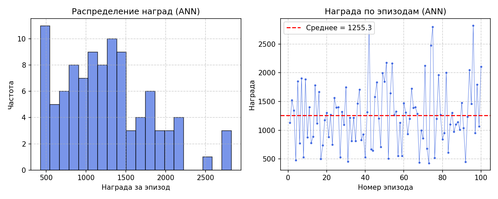

#### Episode lengths

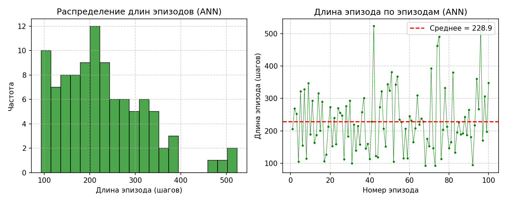

### ANN-256

#### Rewards

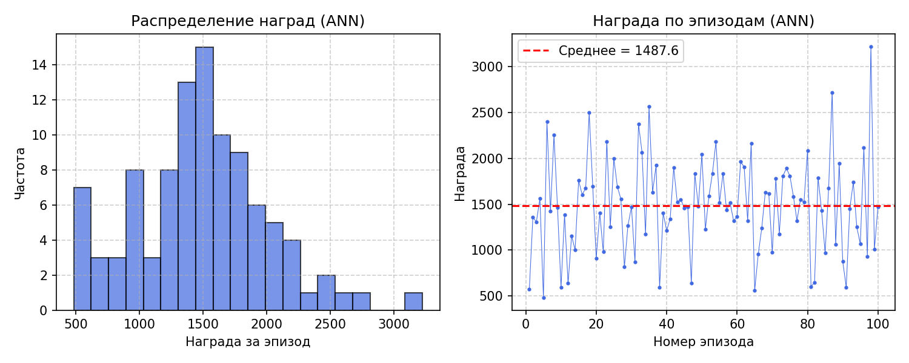

#### Episode lengths

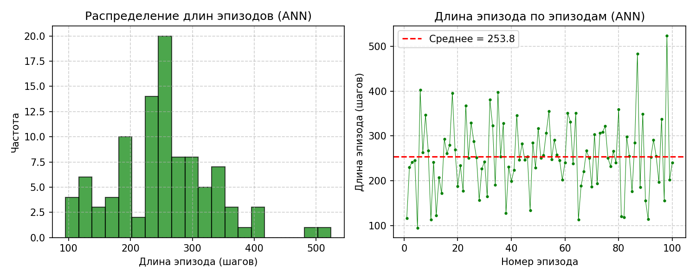

### Converted SNN

#### Rewards

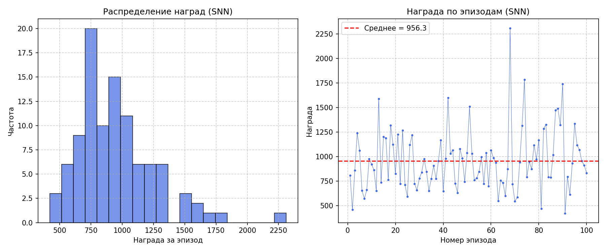

#### Episode lengths

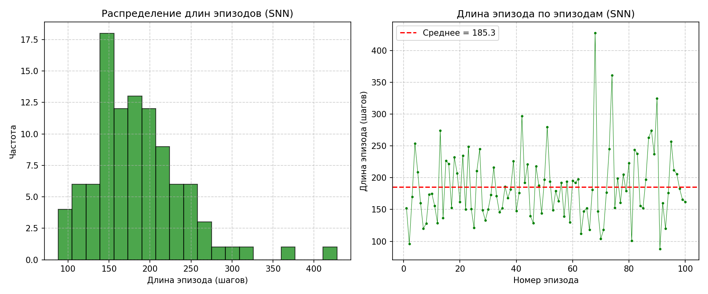

### Hybrid SNN

#### Rewards

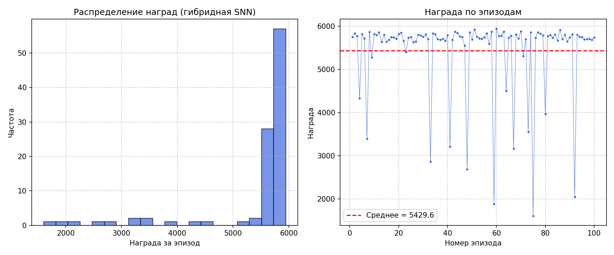

#### Episode lengths

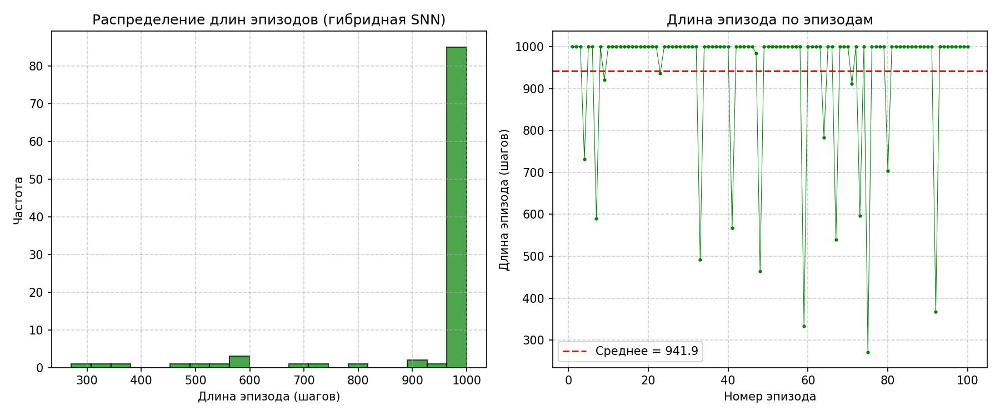

---

## Demo video

### ANN-128

[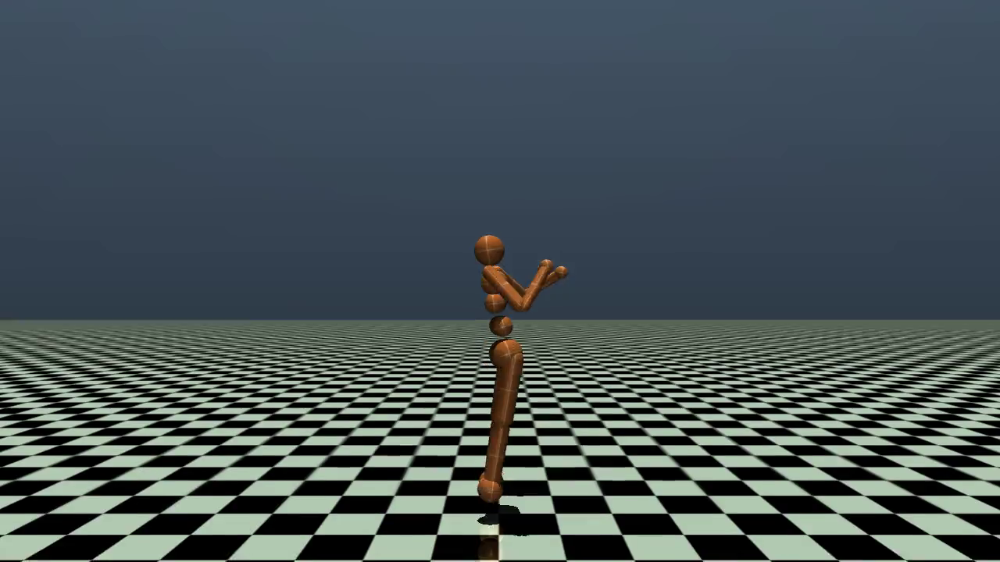](demo/ann_128_demo.mp4)

### ANN-256

[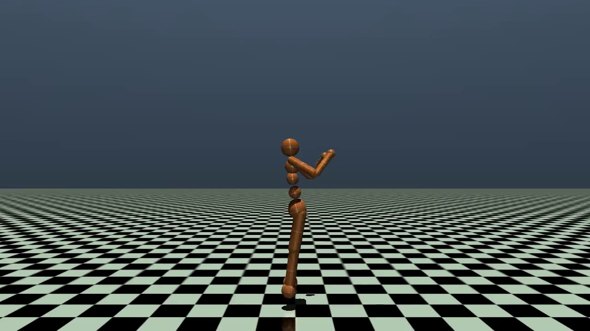](demo/ann_256_demo.mp4)

### Converted SNN

[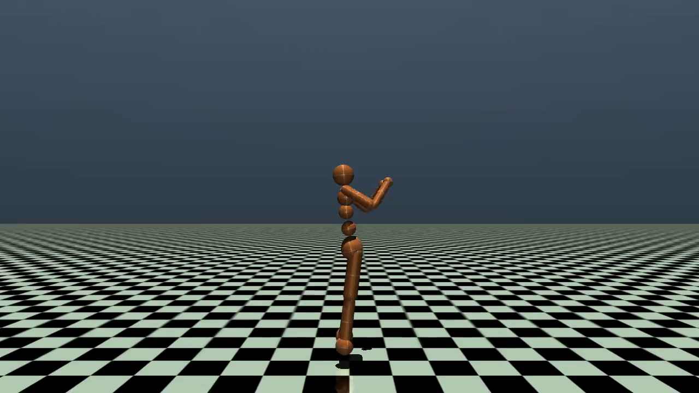](demo/converted_snn_demo.mp4)

### Hybrid SNN

[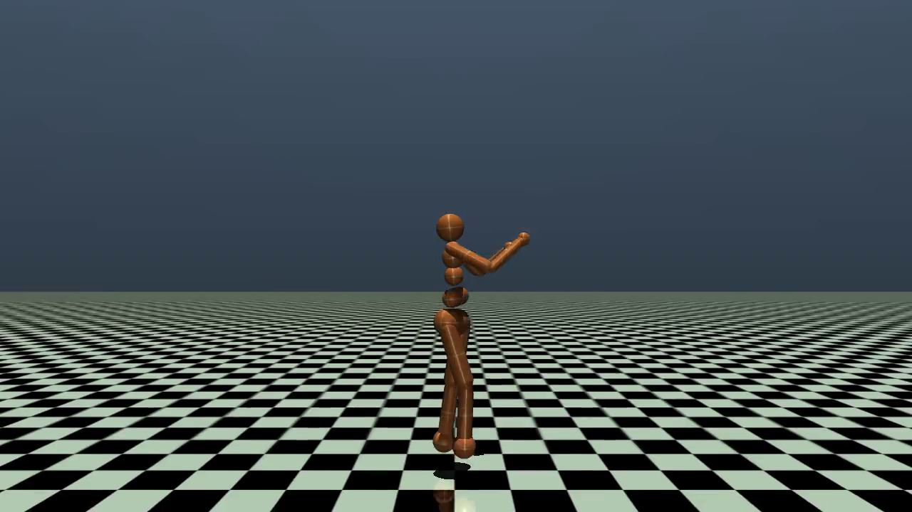](demo/hybrid_snn_demo.mp4)

---

## Main scripts

| Script | Description |
|---|---|
| `scripts/train_ann.py` | Trains ANN-128 or ANN-256 with PPO |
| `scripts/convert_ann_to_snn.py` | Converts the trained ANN-256 actor into an SNN actor |
| `scripts/train_hybrid_snn.py` | Trains the Hybrid SNN model with PPO |
| `scripts/test_ann.py` | Tests ANN-128 or ANN-256 |
| `scripts/test_converted_snn.py` | Tests the converted SNN |
| `scripts/test_hybrid_snn.py` | Tests the Hybrid SNN |


---

## Author

Ekaterina Larina  
Bachelor thesis project, 2026
